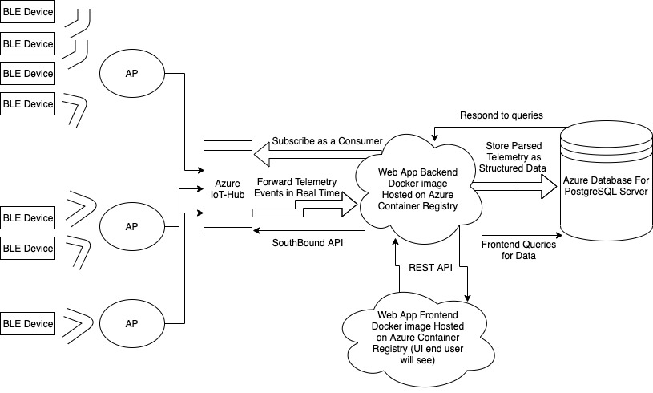

# aos8-iot-server-example-azure

## Overview
This project is a detailed yet simple to use demo application meant to provide a starting template for Aruba Partners and individuals who want to learn how to:

- Connect to Azure IoT Hub instances to ingest telemetry from IoT devices (Aruba NorthBound API)
- Breakdown (parse) telemetry received from IoT Hub and store parsed information into a structured, scalable, and optimized database
- Visualize and present telemetry directly from IoT Hub in different intuitive UI components
- View live telemetry using websockets
- Demonstrate how to control IoT devices using Aruba SouthBound API in an interactive manner

## Architecture

## Software Used
- [node.js] 
- [Express] 
- [Microsoft Azure Database for PostgreSQL]
- [Microsoft Azure IoT-Hub] 
- [Vue.js] 
- [Bulma] 
- [Dygraphs] 
- [Timescale DB]

## Tutorial: Run Web App on Azure
**Pre-requisites**
1. Install/update to latest version Azure CLI and Docker engine
    - Please make sure that azure cli and docker engine are installed and/or updated to the most recent version
    - Azure CLI installation: https://docs.microsoft.com/en-us/cli/azure/install-azure-cli
    - Docker engine: https://docs.docker.com/get-docker/ 
2. An active Azure subcription is required
3. Ensure Docker Engine is running

**Setup using Azure Portal and Command Line**
1. Create azure database for postgres server
    - **NOTE**: telemetry scale requirements might affect web app functionality if there is a resource constraint on the server (see: troubleshooting)
    - Login to azure portal
    - search for and click on resource "Azure Database for PostgreSQL servers"
    - select create
    - select the create button on the 'Single Server' panel (flexibile server has not been tested with app)
    - Fill out basic settings
        - create a new resource group or use an existing
        - Pick a name for your server
        - Select desired location (a location nearest to you)
        - admin username and password
        - all other settings can remain on default (storage + compute should be edited based on costs and needs)
    - Select review+create
    - after resource has deployed, select go to resource
    - Under settings > connection security > Firewall Rules 
        - click on Add 0.0.0.0 - 255.255.255.255 (or just add your IP address / any IP address you wish to give access to your db)
        - Select Save to preserve your changes. You get a notification once the change is saved.
    - Log in to database using psql (a default database called "postgres" is created automatically) using a terminal of choice or azure cloud shell
        - Information about the database that are needed to log into the database can be found under the 'overview' tab
        - psql --set=sslmode=require --host=<myservername>.postgres.database.azure.com --port=5432 --username=<myadmin>@<myservername> --dbname=postgres 
        - enter the password for the admin username you created earlier
    - you can now use your postgres database with postgres queries / commands as needed

2. Installing TimescaleDB on existing Azure database for PostGres
    - To install TimescaleDB, you need to include it in the server's shared preload libraries. A change to Postgres's shared_preload_libraries parameter requires a server restart to take effect. You can change parameters using the Azure portal or the Azure CLI.
    - Using the Azure portal:
        - Select your Azure Database for PostgreSQL server.
        - On the sidebar, select Server Parameters.
        - Search for the shared_preload_libraries parameter.
        - Select TimescaleDB.
        - Select Save to preserve your changes. You get a notification once the change is saved.
        - After the notification, restart the server to apply these changes
        - Log in to database using psql 
            - psql --set=sslmode=require --host=<myservername>.postgres.database.azure.com --port=5432 --username=<myadmin>@<myservername> --dbname=postgres 
            - enter the password for the admin username you created earlier
            - Create the timescaledb extension:
                - CREATE EXTENSION IF NOT EXISTS timescaledb CASCADE;
3. Real Time Telemetry
    - Log in to database using psql:
        - psql --set=sslmode=require --host=<myservername>.postgres.database.azure.com --port=5432 --username=<myadmin>@<myservername> --dbname=postgres 
        - enter the password for the admin username you created earlier
        - Create a trigger on each row added (the app uses websockets and a postgres listener for the event below for live telemetry features)
            -  CREATE FUNCTION notify_trigger() RETURNS trigger AS $$
DECLARE
BEGIN
    &nbsp; &nbsp; &nbsp; PERFORM pg_notify('new_azurepgmsg', row_to_json(NEW)::text);
    &nbsp; &nbsp; &nbsp; RETURN new;
END;
$$ LANGUAGE plpgsql;
    
            - CREATE TRIGGER ble_table_trigger AFTER INSERT ON tsdatahypertable
FOR EACH ROW EXECUTE PROCEDURE notify_trigger();

4. Set Up IoT Devices, Azure IoT Hub, and Azure DPS
5. Deploy to Azure
    - Create a .env file locally in project root (ex: echo -e "IotHubConnectionString='xxxxxxxxxxxxxxxxxx'\nEventHubConsumerGroup='xxxxxxxxx'\nDBHOST='xxxxxx.postgres.database.azure.com'\nDBUSER='xxxxxxx@xxxxxxx'\nDBPASSWORD='xxxxxxx'\nDATABASE='xxxxxxx'" > .env )
format:
IotHubConnectionString='xxxxxxxxxxxxxxxxxx'
EventHubConsumerGroup='xxxxxxxxx'
DBHOST='xxxxxx.postgres.database.azure.com'
DBUSER='xxxxxxx@xxxxxxx'
DBPASSWORD='xxxxxxx'
DATABASE='xxxxxxx'
    - Build backend image
        - From project root run:
            - docker build --file=backend/Dockerfile -t <docker-image-name> .
    - Register the backend image in Azure Container Registry:
        - login to azure
            - az login (NOTE: tenant id will be one of the fields in the JSON object that is returned, you can optionally use this for later steps)
        - OPTIONAL: create a new resource group
            - az group create --name myResourceGroup --location westus
        - create backend azure container registry
            - az acr create --resource-group myResourceGroup --name <acrName1> --sku Basic
        - Login to registry
            - TOKEN_BE=$(az acr login --name <acrName1> --expose-token --output tsv --query accessToken)
        - Authorize Azure
            - docker login <acrName1>.azurecr.io --username 00000000-0000-0000-0000-000000000000 --password $TOKEN_BE
        - Tag image 
            - docker tag <docker-image-name> <acrName1>.azurecr.io/<docker-image-name>:v1
        - Push to registry
            - docker push <acrName1>.azurecr.io/<docker-image-name>:v1
    - Deploy web app
        - OPTIONAL: create a new resource group
            - az group create --name myResourceGroup --location westus
        - create web app azure container registry
            - az acr create --resource-group myResourceGroup --name <acrName2> --sku Basic
        - Login to registry
            - TOKEN_FE=$(az acr login --name <acrName2> --expose-token --output tsv --query accessToken)
        - Authorize Azure 
            - docker login <acrName2>.azurecr.io --username 00000000-0000-0000-0000-000000000000 --password $TOKEN_FE
        - Modify Docker Yaml file
            - under project root, open the file "docker-compose.yml" with an editor of your choice
            - modify the value of image (under services > app-frontend > image)
                - change "webappfrontendacr.azurecr.io/app-frontend" to <acrName2>.azurecr.io/app-frontend
                - *optionally change "app-frontend" to a different image name if desired*
            - modify the value of image (under services > app-backend > image)
                - change "webappbackendacr.azurecr.io/ao8-iot-server-example-azure_app-backend:v1" to <acrName1>.azurecr.io/<docker-image-name>:v1 (from the previous steps)
        - docker compose up
            - docker-compose up --build -d
        - push docker images
            - docker-compose push
        - login to azure
            - Find tenant id (tenant id is also returned in JSON object from the az login command that was previously run)
                - log into azure portal
                - Select Azure Active Directory.
                - Select Properties.
                - Then, scroll down to the Tenant ID field. Your tenant ID will be in the box.
            - docker login azure --tenant-id xxxxxxxx
        - create azure container instance docker context to host web app
            - docker context create aci <myacicontext>
        - switch to newly created context
            - docker context use <myacicontext>
        - start the application in Azure Container Instances
            - docker compose up
        - view IP address of running web app
            - docker ps
        - Visit web app at <IP_addr_from_docker_ps>:80
        - Troubleshoot
            - ensure schema was created corectly 
                - Log in to database using psql
                - psql --set=sslmode=require --host=<your_env_dbhost>.postgres.database.azure.com --port=5432 --username=<your_env_dbuser> --dbname=<your_env_database> 
                - enter <your_env_dbpassword> when prompted
                - run '\dt' and verify if the schema has been created
            - check console logs for the frontend and backend for errors or unexpected behavior
                - docker logs aos8-iot-server-example-azure_app-backend
                - docker logs aos8-iot-server-example-azure_app-frontend
                - if you see the error message
                    - psql: FATAL: remaining connection slots are reserved for non-replication superuser connections
                    - this means that the database resources are insufficient to handle the telemetry workload
                    - to solve: adjust the speed and scale at which telemetry is being sent to iothub OR increase constraints of postgres server
        - Bring down web app
            - run 'docker compose down' in project root (ensure that you are still using your acicontext for docker, see step 9)
        - How to run web app again after making changes:
            - *recommended → run docker compose down before deploying again*
            - docker context use default; docker ps
                - verify that both the frontend and backend images are still running
                - if they are not, run 
                    - docker push <acrName1>.azurecr.io/<docker-image-name>:v1
                    - docker-compose up --build -d
                    - docker-compose push
                    - docker context use <myacicontext>
                - After verifying images are running:
                    - docker compose up; docker ps

## Tutorials
- IoT-Hub from node js: 
- Starter code for web application: https://docs.microsoft.com/en-us/azure/cosmos-db/sql-api-nodejs-application
- Interact with Cosmos DB using Node JS: https://docs.microsoft.com/en-us/azure/cosmos-db/sql-api-nodejs-samples
- https://blog.baeke.info/2019/04/15/iot-with-azure-database-for-postgresql-and-timescaledb/
- Create azure for postgres using portal: 
    - https://kimadeline.github.io/blog/posts/redwoodjs-azure-postgresql/#diving-in
    - https://docs.microsoft.com/en-us/azure/postgresql/quickstart-create-server-database-portal
- send c2d messages: https://docs.microsoft.com/en-us/azure/iot-hub/iot-hub-node-node-c2d
- Dockerize web app: https://milanwittpohl.com/projects/tutorials/Full-Stack-Web-App/dockerizing-our-front-and-backend
- Web app: 
    - https://docs.microsoft.com/en-us/azure/container-instances/tutorial-docker-compose
    - https://docs.microsoft.com/en-us/azure/container-instances/container-instances-tutorial-prepare-acr 
    - https://docs.microsoft.com/en-us/azure/container-registry/#:~:text=Azure%20Container%20Registry%20allows%20you,container%20development%20and%20deployment%20pipelines
    - https://docs.docker.com/cloud/aci-integration/
    - https://docs.microsoft.com/en-us/azure/active-directory/fundamentals/active-directory-how-to-find-tenant
    - https://docs.microsoft.com/en-us/azure/container-registry/container-registry-authentication?tabs=azure-cli
- PostgreSQL:
    - https://docs.microsoft.com/en-us/azure/app-service/tutorial-python-postgresql-app?toc=https%3A%2F%2Fdocs.microsoft.com%2Fen-us%2Fazure%2Fpostgresql%2Ftoc.json&bc=https%3A%2F%2Fdocs.microsoft.com%2Fen-us%2Fazure%2Fbread%2Ftoc.json&tabs=bash%2Cclone&pivots=postgres-flexible-server
    - https://azure.microsoft.com/en-us/blog/power-iot-and-time-series-workloads-with-timescaledb-for-azure-database-for-postgresql/
    - https://www.educative.io/blog/what-is-foreign-key-database
- Timescale DB:
    - https://www.youtube.com/watch?v=MFudksxlZjk
    - https://docs.timescale.com/timescaledb/latest/
- Cosmos DB Documentation
    - https://docs.microsoft.com/en-us/azure/cosmos-db/use-cases#iot-and-telematics
    - https://docs.microsoft.com/en-us/azure/cosmos-db/modeling-data
    - https://docs.microsoft.com/en-us/azure/cosmos-db/partitioning-overview
    - https://docs.microsoft.com/en-us/azure/cosmos-db/how-to-model-partition-example
- Cosmos DB vs TimsescaleDB
    - https://db-engines.com/en/system/Microsoft+Azure+Cosmos+DB%3BTimescaleDB

[//]: # (These are reference links used in the body of this note and get stripped out when the markdown processor does its job. There is no need to format nicely because it shouldn't be seen. Thanks SO - http://stackoverflow.com/questions/4823468/store-comments-in-markdown-syntax)

   [git-repo-url]: <https://github.com/joemccann/dillinger.git>
   [Microsoft Azure Database for PostgreSQL]: <https://azure.microsoft.com/en-us/services/postgresql/>
   [Microsoft Azure IoT-Hub]: <https://azure.microsoft.com/en-us/services/iot-hub/>
   [node.js]: <http://nodejs.org>
   [Vue.js]: <https://vuejs.org/>
   [Bulma]: <https://bulma.io/>
   [Dygraphs]: <https://dygraphs.com/>
   [express]: <http://expressjs.com>
   [AngularJS]: <http://angularjs.org>
   [Timescale DB]: <https://www.timescale.com/>
